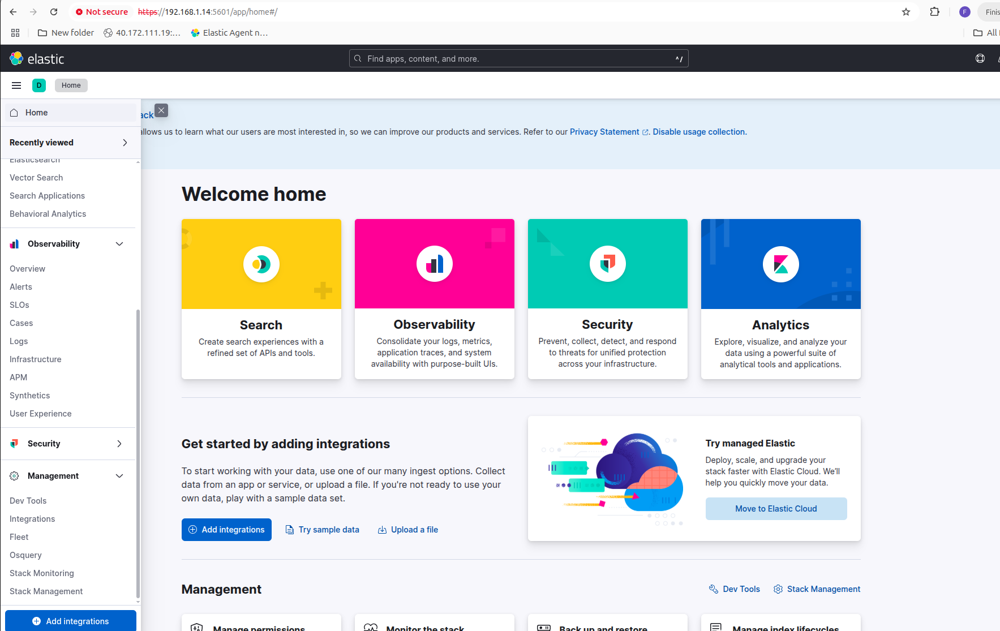

# Setting Up Secure Elastic Stack with Data Integrations via Elastic Agents and Fleet Manager

## Prerequisites

Before starting, ensure you have the following:

* 3-4 VMs
* SSH enabled on all VMs
* IP addresses of each VM
* Usernames and passwords **or** SSH keys for each VM

## Clone the Repository

```bash
git clone https://github.com/faisalumerr/elasticsearch.git
cd elasticsearch
```

## Update Inventory

Edit the inventory file to reflect your VM details:

```
├── inventories
│   └── hosts.ini
```

Example entry for a VM:

```
vm1 ansible_host=192.168.1.13 ansible_user=vboxuser ansible_ssh_pass=changeme ansible_become_pass=changeme
```

Update `ansible_host`, `ansible_user`, and authentication details (password or key) for all your VMs.

## What Will Be Installed

The scripts will automatically install and configure the following:

**Elasticsearch**

* VM1 – Master + Hot + ML
* VM2 – Master + Hot + Warm

**Kibana**

* VM2

Elastic Agents will also be installed and enrolled via the Fleet Manager.

## Running the Playbook

### If Using Password Authentication

Run the following command from the root folder of the repository:

```bash
ansible-playbook -i inventories/hosts.ini deploy.yml --ask-become-pass
```

You will be prompted to provide the sudo password of your host machine.

### If Using SSH Key Authentication

If you are using an SSH key instead of username/password, run:

```bash
ansible-playbook -i inventories/hosts.ini deploy.yml --private-key tt_431.pem --ask-become-pass
```

Provide your sudo password when prompted.


---

## Accessing Kibana

After the installation is completed, open your browser and navigate to:

```
https://<VM2_IP>:5601
```


You may see a browser warning about an unsafe certificate.

1. Click **Advanced**.
2. Proceed to `<server IP>` (unsafe).


---

### Login Credentials

* **Username:** `elastic`
* **Password:** Can be found in the repository at:

```
├── group_vars
│   └── all
│       └── secrets.yml
```

Look for the key:

```yaml
elastic_password: <value>
```

---

### Accessing Fleet Manager

1. In the Kibana sidebar, scroll down and click **Fleet**.



From here, you can **add Elastic Agents, manage integrations, and configure data streams**.


Go to fleet settings


### Editing Outputs

1. Edit the outputs as needed and click **Save and Deploy**.


---

### Adding Fleet Server

1. Click **Add Fleet Server**.


2. Click **Advanced**.


3. Click **Create Policy**.


4. In **Deployment Mode**, choose **Production**.
5. Add a Fleet Server name and replace the IP in the same format.


6. Click **Add Host**.
7. Generate a **Service Token**.

---

### Installing Fleet Server

Replace the certificates and run the following commands on your Fleet Server machine:

```bash
curl -L -O https://artifacts.elastic.co/downloads/beats/elastic-agent/elastic-agent-8.13.0-linux-x86_64.tar.gz
tar xzvf elastic-agent-8.13.0-linux-x86_64.tar.gz
cd elastic-agent-8.13.0-linux-x86_64
sudo ./elastic-agent install --url=https://192.168.1.13:8220 \
  --fleet-server-es=https://192.168.1.14:9200 \
  --fleet-server-service-token=<SERVICE_TOKEN> \
  --fleet-server-policy=fleet-server-policy \
  --certificate-authorities=/etc/elasticsearch/cert.crt \
  --fleet-server-es-ca=/etc/elasticsearch/cert.crt \
  --fleet-server-cert=/usr/share/elasticsearch/fleet-server/fleet-server.crt \
  --fleet-server-cert-key=/usr/share/elasticsearch/fleet-server/fleet-server.key \
  --fleet-server-port=8220
```


Once installation is done, you will see the agents in the Kibana console:


Click **Continue Enrolling Elastic Agent**.

---

### Installing Elastic Agents on Other Machines

1. Click **Create Policy**.


2. Copy the installation command:


Example command:

```bash
curl -L -O https://artifacts.elastic.co/downloads/beats/elastic-agent/elastic-agent-8.13.4-linux-x86_64.tar.gz
tar xzvf elastic-agent-8.13.4-linux-x86_64.tar.gz
cd elastic-agent-8.13.4-linux-x86_64
sudo ./elastic-agent install --url=https://192.168.1.13:8220 --enrollment-token=<ENROLLMENT_TOKEN>
```

Append the certificate authority flag:

```bash
sudo ./elastic-agent install --url=https://192.168.1.13:8220 --enrollment-token=<ENROLLMENT_TOKEN> --certificate-authorities=/etc/elasticsearch/cert.crt
```

Run this on each machine where you want to install an Elastic Agent:

```bash
curl -L -O https://artifacts.elastic.co/downloads/beats/elastic-agent/elastic-agent-8.13.4-linux-x86_64.tar.gz
tar xzvf elastic-agent-8.13.4-linux-x86_64.tar.gz
cd elastic-agent-8.13.4-linux-x86_64
sudo ./elastic-agent install --url=https://192.168.1.13:8220 --enrollment-token=<ENROLLMENT_TOKEN> --certificate-authorities=/etc/elasticsearch/cert.crt
```

Once complete, the agents will appear in the Kibana console:


---

## Configuring Kibana Spaces and Roles

1. Navigate to **Stack Management** in Kibana.


2. Click **Spaces** under Kibana and create a new space:


* Name it `dashboard_viewer`.
* Uncheck all boxes except **Analytics** and **Management**.


3. Click **Create Space**.

---

### Creating a Dashboard Role

1. Go to **Roles** under Stack Management → Security.
2. Click **Create Role**.
3. Name the role `dashboard_viewer`.
4. Assign the following:

   * Indices: `logs-*` and `metrics-*` with permissions `read` and `view_index_metadata`.


5. Add Kibana privileges for `dashboard_viewer` space:

   * Dashboard read access
   * Saved objects management


6. Finish creating the role.

---

### Creating a Dashboard User

1. Create a user and assign the `dashboard_viewer` role.


---

### Exporting and Importing Dashboards

1. Navigate to **Saved Objects** in Stack Management → Kibana.
2. Select dashboards to export and click **Export All**.


3. Logout and log in as the dashboard user.


4. Go to **Stack Management → Saved Objects**, and import the exported dashboards:


5. Logout as the dashboard user, log in as the default user, and remove the **Saved Objects Management** privilege from the `dashboard_viewer` role:


6. Log in again as the dashboard user. The user will now only have access to analytics and the imported dashboards:


---

# syslog server on Ubuntu

A step-by-step guide to set up a **syslog server on Ubuntu** and configure it for custom logs (like for Elastic agents):

---

### **1. Update your system**

```bash
sudo apt update
sudo apt install rsyslog -y
```

---

### **2. Enable UDP reception in rsyslog**

Open the main rsyslog configuration:

```bash
sudo nano /etc/rsyslog.conf
```

Uncomment or add the following lines to enable UDP reception on port 514:

```conf
module(load="imudp")        # loads the UDP listener module
input(type="imudp" port="514")
```

---

### **3. Create a custom rsyslog configuration for Elastic**

```bash
sudo nano /etc/rsyslog.d/elastic-syslog.conf
```

Add this content to direct all logs to a separate file:

```conf
if ($fromhost-ip != "127.0.0.1") then {
    action(type="omfile" file="/var/log/remote/remote.log")
    stop
}
if ($fromhost-ip != "127.0.0.1") then {
    action(type="omfile" file="/var/log/remote/remote.log")
    stop
}

```

> This will log **all messages**. You can refine the filter if needed, e.g., only `auth.*` or `local0.*`.

---

### **4. Create the log file and set permissions**

```bash
sudo touch /var/log/remote/remote.log
sudo chmod 644 /var/log/remote/remote.log
```

---

### **5. Restart rsyslog**

```bash
sudo systemctl restart rsyslog
sudo systemctl enable rsyslog
```

---

### **6. Verify syslog is listening on UDP 514**

```bash
sudo netstat -ulnp | grep 514
```

You should see `rsyslogd` listening on `udp 514`.

---

### ✅ **Optional: Test logging**

From another machine or the same server, you can send a test message:

```bash
logger -p local0.info "This is a test syslog message"
tail -f /var/log/syslog-alerts.log
```


# **Python Script: Elasticsearch Log Volume Monitor**

This Python script `alerts.py` monitors the log volume in an Elasticsearch cluster over the last 5 minutes and sends an alert to a syslog server if the log count falls below a defined threshold.

**Key Features:**

* Connects to Elasticsearch using basic authentication.
* Queries the `_count` API for logs in a specified index pattern (`logs-*`) within the last 5 minutes.
* Compares the number of logs against a configurable threshold (`LOGS_THRESHOLD`).
* Sends an alert message via UDP to a syslog server if log volume is below the threshold.
* Logs info and error messages to the console for monitoring and debugging.

**Use Case:**
Ideal for monitoring log ingestion in real-time and alerting when logs are missing, ensuring early detection of potential issues in log pipelines.

Script Variables to Configure:

ES_HOST: "https://<elasticsearch_ip>:9200"
ES_USER: "<elastic_user>"
ES_PASS: "<elastic_password>"
INDEX_PATTERN: "logs-*"
LOGS_THRESHOLD: 1000

SYSLOG_SERVER: "<syslog_server_ip>"
SYSLOG_PORT: 514


Make sure the Syslog server is configured and running before executing the script.

On running this python script I am receving the alerts on rsyslog server

